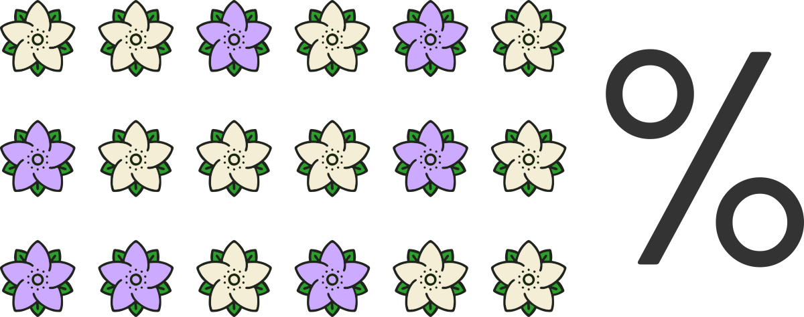
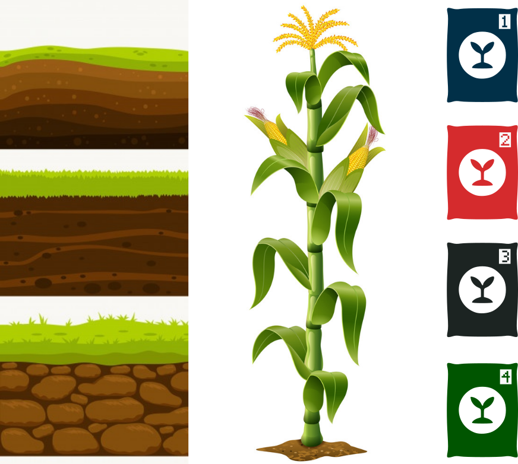
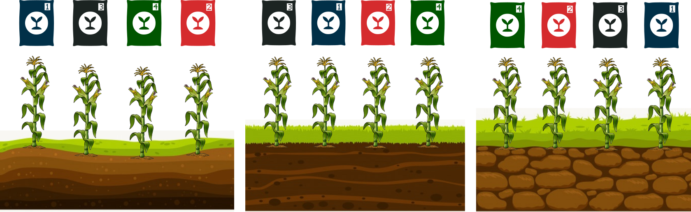

## Revisão Estatística Inferencial
  


## Tipos de Inferência


### Inferência Dedutiva

> É o método de derivar informação de fatos ou declarações aceitas como verdadeiras (**Premissas**)


Exemplo:

i) Um dos ângulos interiores de um triângulo retângulo tem 90˚.

ii) $\textbf A$ é um triângulo retângulo.

 


Se aceitarmos as premissas como verdadeiras, somos forçados a concluir:

iii) Um dos ângulos interiores de $\textbf A$ tem 90˚.


### Inferência Indutiva

> Processo de raciocínio indutivo, em que se procuram tirar conclusões indo do **particular** para o **geral**.


- É um processo trabalhoso.

- Não é possível fazer generalizações exatas.

- Existe um elemento **obrigatório** de **incerteza**.

- Entretanto, o **grau de incerteza** das generalizações pode ser medido se a **experimentação** acontecer obedecendo certos princípios.

- A incerteza é medida em termos de **probabilidade**.

- Um dos objetivos da Estatística é fornecer métodos de realizar inferências estatísticas e mensurar as incertezas.


## Inferência Estatística


:::{.grid .gridCenter}

:::{.g-col-6 .md-col-6}

{width="400"}

:::

:::{.g-col-6 .md-col-6}

###  Exemplo:

Imagine-se um comerciante de sementes que produzem dois tipos de flores, de um pool de **10 milhões de sementes** contidas em um saco, como saber quantas sementes produzirão flores brancas? Seria inviável plantar o saco completo das sementes, e aguardar todo o processo de germinação. O que poderíamos fazer então?

:::

:::

<br>

:::{.grid .gridCenter}

:::{.g-col-6 .md-col-6}

Poderíamos **selecionar** aleatoriamente uma quantidade **representativa** das sementes, e realizar o processo de germinação, e acompanhar o florescimento para identificarmos a cor das flores. Bem mais plausível digamos, plantar 500 sementes, do que 10 milhões concorda?

:::

:::{.g-col-6 .md-col-6}

{width="500" fig-align="center"}

:::

:::

<br>

:::{.grid .gridCenter}

:::{.g-col-6 .md-col-6}

{width="600" fig-align="right"}

:::

:::{.g-col-6 .md-col-6}

Uma vez floridas, poderíamos então contar a proporção de flores de cada cor, e assim **inferir** a proporção para o total da nossa população, nosso saco de sementes. E esse é justamente o processo que realizanos na inferência estatística. 

:::

:::

<br>

{width="900" fig-align="center"}


**POPULAÇÃO:**  totalidade dos elementos sob discussão, dos quais desejamos informação.


**AMOSTRA:**  qualquer parte (ou subconjunto) de uma população.


> **Inferência estatística** é o processo de especificar valores para **parâmetros desconhecidos** da população, através de **estatísticas** obtidas de um conjunto de **valores observados** numa amostra.


### Estatística, Parâmetro, Estimador e Estimativa


**PARÂMETRO:** é uma medida numérica que descreve uma característica ou propriedade de uma **população**.

$$f(x|\mu, \sigma^2) = \frac{1}{\sigma \sqrt{2\pi}} e^{-\frac{(x-\mu)^2}{2\sigma^2}}, \ \ F.D.P \ da \ Distribuição \ Normal$$
$\large \mu$ média populacional, e $\large \sigma^2$ variância populacional


**ESTATÍSTICA:** é qualquer função da **amostra** que não depende de parâmetros desconhecidos.


$$Média \ Amostral \ \ \ \ \ \bar{x} = \frac{1}{n} \sum_{i=1}^{n} x_i$$


$$Variância \ Amostral \ \ \ \ \ s^2 = \frac{1}{n-1} \sum_{i=1}^{n} (x_i - \bar{x})^2$$


**ESTIMADOR:** É uma regra ou fórmula matemática usada para calcular uma estimativa de um parâmetro desconhecido de uma população com base em dados amostrais. Por exemplo, a média amostral $\large \bar{x}$ é um estimador da média populacional $\large \mu$.


**ESTIMATIVA:** É o valor numérico específico calculado usando um estimador com dados amostrais reais. Por exemplo, se usarmos a média amostral $\large \bar{x}$ para calcular a média de uma amostra de alturas, o valor numérico resultante é a estimativa da média populacional.


$$Estimador \ \ \  \bar{x} = \frac{1}{n} \sum_{i=1}^{n} x_i$$

$$Estimativa \ \ \ \bar{x} = \frac{1}{n} \sum_{i=1}^{n} x_i = \frac{12+13+7+8+10}{5} \implies \bar{x} = 10$$


### Teste de Hipóteses

> Uma **hipótese estatística** é uma afirmação ou suposição sobre os parâmetros de uma ou mais populações. Essas hipóteses são formuladas para serem testadas estatisticamente usando dados amostrais. É uma suposição quanto ao valor de um parâmetro populacional, que será verificada por um **teste paramétrico**, ou uma afirmação quanto à natureza  da população, que será verificada por um **teste de aderência**, entre outros. 

**Hipótese Nula** $(H_0)$: É uma afirmação que assume que não há efeito, não há diferença ou não há associação entre variáveis na população. Geralmente, é a hipótese que o pesquisador está interessado em testar. Por exemplo, "a média de um grupo é igual a um valor específico" ou "não há diferença entre dois grupos".

**Hipótese Alternativa** $(H_1)$: É uma afirmação que contradiz a hipótese nula. Ela sugere que há um efeito, uma diferença ou uma associação na população. Por exemplo, "a média de um grupo é diferente de um valor específico" ou "há uma diferença entre dois grupos".

## Experimentação

> Estudo dos experimentos (planejamento, execução, análise dos dados obtidos e interpretação dos resultados).


**Estudo experimental:** influenciamos nas respostas das unidades experimentais.

**Estudo observacional:** não influenciamos nas respostas das unidades experimentais.

**Experimento ou ensaio:** é um trabalho previamente planejado, que segue determinados princípios básicos e no qual se faz a comparação dos efeitos dos tratamentos.





**Tratamento:** é o método, elemento ou material cujo efeito desejamos medir ou comparar em um experimento. (genótipos, variedades, níveis de proteína na ração, diferentes extratos vegetais, diferentes locais de coleta e outros)

**Unidade experimental ou parcela:** é a unidade que vai receber o tratamento e fornecer os dados que deverão refletir o seu efeito. (Rações: 1 leitão ou um grupo de leitões; Local: 1 peixe; Variedades: um vaso com plantas, etc)


**Delineamento experimental:** é o plano utilizado na experimentação e implica na forma como os tratamentos serão designados às unidades experimentais.  

  + Delineamento inteiramente casualizado (DIC);
  + Delineamento em blocos casualizados (DBC);
  + Entre outros ...
  

### Experimentação - Princípio da Repetição


* Consiste na reprodução do experimento básico;

* Visa propiciar a obtenção de uma estimativa do erro experimental (verificar a variação dentro);

* A repetição consiste em aplicar o mesmo tratamento a várias parcelas ou unidades experimentais num mesmo experimento.


```{r}
#| warning: false
#| message: false
#| echo: false

library(tidyverse, quietly = TRUE)
library(gt, quietly = TRUE)
library(gtExtras, quietly = TRUE)


patos <- tibble::tribble(
~GG,~REP,~PCC,~CPT,~APT,~LPT,~LCX,~LSC,			
"NM",1,1850,189.14,51.41,110.3,66.41,105.36,			
"NM",2,1645,174.84,57.85,108.57,62.09,106.89,			
"NM",3,1935,175.24,42.36,123.44,55.9,118.92,		
"NM",4,2015,173.25,55.05,121.24,58.41,114.6,			
"NF",1,1145,138.89,48.57,92.46,46.06,85.57,			
"NF",2,1100,150.94,45.81,97.6,66.32,75.83,			
"NF",3,1270,144.8,39.79,108.17,45.39,99.73,			
"NF",4,1170,155,44.81,92.15,57.04,82.29
)		

patos |> 
  gt::gt() |>
  gtExtras::gt_theme_guardian() |>
  gt::tab_style(
    style = list(
      cell_fill(color = "#f4d58d")
    ),
    locations = cells_body(columns = REP)
  ) |>
  tab_style(
    style = list(
      cell_text(
        weight = "bold"
      )
    ),
    locations = cells_column_labels()
  ) |>
  tab_options(
    table.font.size = 32,
    table.font.names = "Barlow Condensed"
  )
  

```


### Experimentação - Princípio da Casualização


* Propiciar, a todos os tratamentos, a mesma chance de serem designados a qualquer uma das unidades experimentais;

* Evita que nenhum dos tratamentos seja sistematicamente favorecido ou desfavorecido por fatores externos;

 * Necessário para que as variações que contribuem para o erro experimental, sejam convertidas em variáveis aleatórias.


 
* Permite obter uma **estimativa válida do erro experimental**;

* Garante o uso de testes de significância por tornar os erros experimentais independentes;


<span class="faRed"></span> **sem os princípios básicos da repetição e da casualização não existe experimentação.**

 
### Experimentação - Princípio do Controle Local


* Muito usado, mas não é obrigatório;

* Dividir um ambiente heterogêneo em sub-ambientes homogêneos e tornar o delineamento experimental mais eficiente, pela **redução do erro experimental**.


:::{.grid}

:::{.g-col-6 .md-col-6}
{fig-align="center" width="300"}
:::

:::{.g-col-6 .md-col-6}

###  Exemplo:

Imagine que você deseja avaliar a eficiência de quatro tipos de fertilizante sob o crescimento de uma variedade de milho. Entretanto, a área do experimento apresenta três tipos de solos distintos. Como considerar esta variação no experimento pra que o efeito mensurado sob o crescimento das plantas seja de fato o do fertilizante, e não pelas diferentes características de solo encontradas? 
No **controle local**, submetemos todos os tratamentos a todas as variações de solo controlando assim para a existência de efeito.

:::

:::

<br>

{fig-align="center"}


## Fontes de Variação em um Experimento

* **Premeditada:** É aquela introduzida pelo pesquisador com a finalidade de fazer comparações. Por exemplo: tratamentos.

* **Sistemática:**

    + Variações não intencionais, mas de natureza conhecida;

    + Variação inerente ao material experimental;

    + Podem ser controladas pelo pesquisador (heterogeneidade do solo,  idade dos animais, época de coleta etc.)
  
* **Aleatória:**
    
    + São variações de origem desconhecida, não podendo ser controladas;
    
    + Constituem o erro experimental (variações no material experimental e falta de uniformidade nas condições experimentais);

    + Nem sempre é possível distinguir claramente este tipo de variação da anterior. 


## Teste de Hipótese{#teste-hipotese}


> Fornecem ferramentas que nos permitem rejeitar ou não rejeitar uma hipótese estatística através da evidencia fornecida pela amostra.


**Hipótese Nula** $(H_0)$: É uma afirmação que assume que não há efeito, não há diferença ou não há associação entre variáveis na população. Geralmente, é a hipótese que o pesquisador está interessado em testar. Por exemplo, "a média de um grupo é igual a um valor específico" ou "não há diferença entre dois grupos".

**Hipótese Alternativa** $(H_1)$: É uma afirmação que contradiz a hipótese nula. Ela sugere que há um efeito, uma diferença ou uma associação na população. Por exemplo, "a média de um grupo é diferente de um valor específico" ou "há uma diferença entre dois grupos".


## Região Crítica


:::{.grid .gridCenter}

:::{.g-col-6 .md-col-6 }

```{r}
#| message: false
#| warning: false
#| include: true
#| echo: false

library(ggplot2, quietly = TRUE)
library(tidyverse, quietly = TRUE)
library(ggtext, quietly = TRUE)
library(gt, quietly = TRUE)

library(ggplot2)
library(tidyverse)
library(ggtext)

set.seed(134)
  
  fdist <- tibble(x = rf(100,3,20))
  
  den <- density(fdist$x)
  
  fdist <- tibble(x = den$x, y = den$y)
  
ggplot(data = fdist, aes(x,y)) +
    geom_area(data = fdist |>
                filter(x >= 3),
              aes(x = x, y = y),
              fill = "gray60")  +
    geom_area(data = fdist |>
                filter(x <= 3),
              aes(x = x, y = y),
              fill = "gray90")  +
    geom_segment(
      aes(x = 3.0, xend = 3.0, y = 0, yend = 0.09),
      linetype = 2,
      linewidth = .6) +
    geom_line(linewidth=1) +
    annotate("text",x= 1, y = 0.027, label = "0.99",
             family = "Barlow Condensed Medium",
             size = 6)+
    annotate("text",x= 3.3, y = 0.027, label = "0.01",
             family = "Barlow Condensed Medium",
             size = 6)+
    annotate("text",x= 1, y = 0.2, label = "RA",
             family = "Barlow Condensed Medium",
             size = 7)+
    annotate("text",x= 3.1, y = 0.027, label = "RR",
             family = "Barlow Condensed Medium",
             size = 7)+
    geom_curve(data = tibble(x = 3, y = 0.06,
                             xend = 2.8, yend = 0.14),
               aes(x=x,y=y,xend=xend,yend=yend),
               color = "gray20",
               arrow = arrow(
                 angle = 30, 
                 length = unit(0.1, "inches"),
                 ends = "last", type = "closed"
               ),
               linewidth = .5,
               curvature = -0.5) +
    geom_curve(data = tibble(x = 3.5, y = 0.03,
                             xend = 3.7, yend = 0.10),
               aes(x=x,y=y,xend=xend,yend=yend),
               color = "gray20",
               arrow = arrow(
                 angle = 30, 
                 length = unit(0.1, "inches"),
                 ends = "last", type = "closed"
               ),
               linewidth = .5,
               curvature = 0.4) +
    geom_richtext(data = tibble(x = 2.7, y = 0.16, label = "<i>F</i><sub>0.01</sub>(3,20) = 4.94"),
                  aes(x,y,label = label),
                  family = "Barlow Condensed Medium",
                  size = 6,
                  label.color = NA,
                  fill = NA,
                  nudge_x = 0.15
    ) +
    geom_richtext(data = tibble(x = 3.7, y = 0.12, label = "<i>F</i><sub>CALC</sub> = 5.40"),
                  aes(x,y,label = label),
                  family = "Barlow Condensed Medium",
                  size = 6,
                  label.color = NA,
                  fill = NA
    ) +
    scale_x_continuous(limits = c(0,4), expand = c(0,0)) +
    scale_y_continuous(expand = expansion(mult = c(0,0))) +
    theme_classic(base_size = 18, base_family = "Barlow Condensed Medium") +
    coord_cartesian(clip = "off") +
    theme(
      panel.grid = element_blank(),
      axis.title = element_blank(),
      axis.text = element_blank(),
      axis.ticks = element_blank(),
      plot.margin = margin(t = 20,  # Top margin
                           r = 10,  # Right margin
                           b = 60,  # Bottom margin
                           l = 10),
      axis.line = element_line(arrow = arrow(
        angle = 30, 
                 length = unit(0.1, "inches"),
                 ends = "last", type = "closed"
      ))
      
    )

```

:::

:::{.g-col-6 .md-col-6}

* É a faixa de valores da estatística dos testes que nos levam à rejeição da hipótese $H_0$;

* Se o valor da estatística do teste ($z$, $t$, $F$ etc) pertença à região crítica, rejeita-se $H_0$;

* Qualquer decisão tomada implica na possibilidade de cometer, basicamente, dois tipos de erros: **erro tipo I** e **erro tipo II**.

:::

:::


## Erro Tipo I e Erro Tipo II


```{r}
#| message: false
#| echo: false

library(gt)
tibble::tribble(
  ~decisao,~verd,~falso,
  "Rejeitar $H_0$","$\\large \\alpha$","$\\large 1 - \\beta$",
  "Aceitar $H_0$","$\\large 1- \\alpha$","$\\beta$"
) |>
  gt::gt() |>
  gt::fmt_markdown() |>
  gt::cols_label(verd = md("$H_0$ é verdadeira"),
                 falso = md("$H_0$ é falsa"),
                 decisao = md("**Decisão**")) |>
  gt::tab_spanner(label = md("**Realidade**"),
                  id = "realidade",
                  columns = c(decisao,verd,falso)) |>
  gt::tab_options(table.width = "100%",
                  table.font.size = 22) |>
  tab_style(
    style = cell_borders(
      sides = c("top","bottom"),
      color = "black",
      weight = px(2),
      style = "solid"
    ),
    locations = list(cells_body(),
                     cells_stub(),
                     cells_column_labels()
                     )
  ) |>
  tab_style(
    style = cell_borders(
      sides = c("top","bottom"),
      color = "black",
      weight = px(2.5),
      style = "solid"
    ),
    locations = list(cells_column_spanners(spanners = 'realidade')
                     
                     )
  )
  
  
```


**Erro Tipo I (Falso Positivo):**

**Definição:** Um erro tipo I ocorre quando você **rejeita uma hipótese nula verdadeira** ($\large \alpha$).

Analogia: É como quando o detetive prende uma pessoa inocente, pensando que ela é culpada.

**Erro Tipo II (Falso Negativo):**

**Definição:** Um erro tipo II ocorre quando você **falha em rejeitar uma hipótese nula falsa** ($\large \beta$).

Analogia: É como quando o detetive deixa escapar um criminoso culpado, pensando que ele é inocente.


## P-valor (_p-value_)

* $\large \alpha \ = \ P$  (cometer o erro tipo I) 

* **p-value:** corresponde ao menor nível de significância para a qual $H_0$ poderia ter sido rejeitada (nível mínimo de significância para rejeição de $H_0$). Probabilidade de rejeitar $H_0$  devido a variáções aleatórias.


* De maneira simples:

  + Se p-value $\large \leq \alpha$ (rejeita-se $H_0$);
  
  + Se p-value $\large \gt \alpha$ (aceita-se $H_0$).

  
  
   Não é a probabilidade da hipótese nula ser verdadeira!


   Não é a probabilidade de rejeitar dado a hipótese nula!

   é a probabilidade de se observar uma estatística tão ou mais extrema do que a observada, no melhor cenário sob a hipótese nula.
  
  


## ANOVA - Análise de Variância


* Técnica que estuda grupos de médias de tratamentos e verifica se existem diferenças significativas entre elas.

* A ideia da ANOVA é **particionar a variância na resposta** entre a associada aos **preditores** e ao **erro**. 

* Os preditores (variáveis independentes) são comumente chamados de **fatores** com diferentes **níveis**, e os parâmetros da regressão chamados de **efeitos**.


```{r}
#| echo: false

tibble::tribble(
  ~fv,~gl,~sq,~qm,~stat,
  "Variedades<br>(entre variedades)","3","1636","545.3","5.40<sup>**</sup>",
  "Erro Experimental<br>(dentro de variedades)","20","2018","100.9","",
  "**Total**","23","3654","",""
) |>
  gt::gt() |>
  gt::fmt_markdown() |>
  gt::cols_label(fv = md("**Fontes de Variação (FV)**"),
                 gl = md("**Graus de Liberdade (GL)**"),
                 sq = md("**Soma de Quadrados (SQ)**"),
                 qm = md("**Quadrado Médio (QM)**"),
                 stat = md("***F***")) |>
  gt::tab_options(table.width = "100%",
                  table.font.size = 24) |>
  tab_style(
    style = cell_borders(
      sides = c("top","bottom"),
      color = "black",
      weight = px(2),
      style = "solid"
    ),
    locations = list(cells_body(),
                     cells_stub(),
                     cells_column_labels()
                     )
  ) |>
  tab_style(
    style = cell_text(
      align = "center"
    ),
    locations = list(
      cells_body(columns = c(gl,sq,qm,stat)),
      cells_column_labels( columns = c(gl,sq,qm,stat))
      )
  )
```


:::{.grid .gridCenter}

:::{.g-col-6 .md-col-6}

$F_{calc} = 5.40 \gt F_{tab}(\alpha = 0.01,3,20) = 4.94$ 

A diferença entre médias de tratamentos é significativa (p < 0.01).

Rejeita-se $H_0: \mu_1 = \mu_2 = \mu_3 = \mu_4$

:::

:::{.g-col-6 .md-col-6}
```{r}
#| message: false
#| warning: false
#| include: true
#| echo: false
#| fig-height: 4


library(ggplot2, quietly = TRUE)
library(tidyverse, quietly = TRUE)
library(ggtext, quietly = TRUE)
library(gt, quietly = TRUE)

library(ggplot2)
library(tidyverse)
library(ggtext)

set.seed(134)
  
  fdist <- tibble(x = rf(100,3,20))
  
  den <- density(fdist$x)
  
  fdist <- tibble(x = den$x, y = den$y)
  
ggplot(data = fdist, aes(x,y)) +
    geom_area(data = fdist |>
                filter(x >= 3),
              aes(x = x, y = y),
              fill = "gray60")  +
    geom_area(data = fdist |>
                filter(x <= 3),
              aes(x = x, y = y),
              fill = "gray90")  +
    geom_segment(
      aes(x = 3.0, xend = 3.0, y = 0, yend = 0.09),
      linetype = 2,
      linewidth = .6) +
    geom_line(linewidth=1) +
    annotate("text",x= 1, y = 0.027, label = "0.99",
             family = "Barlow Condensed Medium",
             size = 6)+
    annotate("text",x= 3.3, y = 0.027, label = "0.01",
             family = "Barlow Condensed Medium",
             size = 6)+
    annotate("text",x= 1, y = 0.2, label = "RA",
             family = "Barlow Condensed Medium",
             size = 7)+
    annotate("text",x= 3.1, y = 0.027, label = "RR",
             family = "Barlow Condensed Medium",
             size = 7)+
    geom_curve(data = tibble(x = 3, y = 0.06,
                             xend = 2.8, yend = 0.14),
               aes(x=x,y=y,xend=xend,yend=yend),
               color = "gray20",
               arrow = arrow(
                 angle = 30, 
                 length = unit(0.1, "inches"),
                 ends = "last", type = "closed"
               ),
               linewidth = .5,
               curvature = -0.5) +
    geom_curve(data = tibble(x = 3.5, y = 0.03,
                             xend = 3.7, yend = 0.10),
               aes(x=x,y=y,xend=xend,yend=yend),
               color = "gray20",
               arrow = arrow(
                 angle = 30, 
                 length = unit(0.1, "inches"),
                 ends = "last", type = "closed"
               ),
               linewidth = .5,
               curvature = 0.4) +
    geom_richtext(data = tibble(x = 2.7, y = 0.16, label = "<i>F</i><sub>0.01</sub>(3,20) = 4.94"),
                  aes(x,y,label = label),
                  family = "Barlow Condensed Medium",
                  size = 6,
                  label.color = NA,
                  fill = NA,
                  nudge_x = 0.15
    ) +
    geom_richtext(data = tibble(x = 3.7, y = 0.12, label = "<i>F</i><sub>CALC</sub> = 5.40"),
                  aes(x,y,label = label),
                  family = "Barlow Condensed Medium",
                  size = 6,
                  label.color = NA,
                  fill = NA
    ) +
    scale_x_continuous(limits = c(0,4), expand = c(0,0)) +
    scale_y_continuous(expand = expansion(mult = c(0,0))) +
    theme_classic(base_size = 18, base_family = "Barlow Condensed Medium") +
    coord_cartesian(clip = "off") +
    theme(
      panel.grid = element_blank(),
      axis.title = element_blank(),
      axis.text = element_blank(),
      axis.ticks = element_blank(),
      plot.margin = margin(t = 20,  # Top margin
                           r = 10,  # Right margin
                           b = 60,  # Bottom margin
                           l = 10),
      axis.line = element_line(arrow = arrow(
        angle = 30, 
                 length = unit(0.1, "inches"),
                 ends = "last", type = "closed"
      ))
      
    )

```
:::

:::


## Modelo Estatísto

> Um modelo estatístico é uma **representação matemática ou probabilística** de um fenômeno, processo ou sistema que está sujeito a **variações aleatórias**. Ele é desenvolvido com base em dados observados ou experimentais e é utilizado para descrever, entender, prever ou controlar o comportamento do fenômeno em questão. **Visa identificar que fatores estão influenciando a variável em estudo (resposta)**.


$$\Large y_{ij} = \mu + t_{i} + \epsilon_{ij}$$


$y_{ij}$ : valor observado para a VD no i-ésimo tratamento na j-ésima repetição.

$\mu$ : média geral do experimento (intercepto) para a VD.

$t_{i}$ : efeito do particular tratamento $i$ no valor observado $y_{ij}$.

$\epsilon_{ij}$ : erro aleatório associado a observação $y_{ij}$.

## ANOVA no 

Utilizamos a função `aov` que recebe como argumento a declaração do nosso **modelo estatístico** e o conjunto de dados.


#### Modelo Estatístico

$$\textbf{PCC} \sim \mu \ + \ \textbf{GG} \ + \ \varepsilon$$

Na declaração do modelo na função `aov` declaramos somente a nossa variável resposta e os fatores (preditores) a serem testados. 

A média geral $\mu$ e o erro aleatório $\varepsilon$  são inseridos internamente pela função.

```{r}
#| echo: true

# Carrega o conjunto de dados
patos <- read.csv("data/dadosPatos.csv")

# Chama a função `aov` para realizar a ANOVA
anovaPCC <- aov(PCC ~ GG, data = patos) 

# Exibe a tabela da Anova
anovaPCC |> summary()


```


$\textbf{LCX} \sim \mu \ + \ \textbf{GG} \ + \ \varepsilon$

```{r}
anovaPCC <- aov(LCX ~ GG, data = patos) 
anovaPCC |> summary()

```

$\textbf{APT} \sim \mu \ + \ \textbf{GG} \ + \ \varepsilon$

```{r}
anovaPCC <- aov(APT ~ GG, data = patos) 
anovaPCC |> summary()


```


## ANOVA no  ... como os fenícios

```{r}
#| echo: false

tibble::tribble(
  ~fv,~gl,~sq,~qm,~stat,
  md("Variedades<br>(entre variedades)"),md("$t-1$"),md("$SQ_{Trat}$"),md("$\\frac{SQ_{Trat}}{GL_{Trat}}$"),md("$\\frac{QM_{Trat}}{QM_{Res}}$"),
  md("Erro Experimental<br>(dentro de variedades)"),md("$n-t$"),md("$SQ_{Res}$"),md("$\\frac{SQ_{Res}}{GL_{Res}}$"),md(""),
  md("**Total**"),md("$n-1$"),md("$SQ_{Total}$"),md(""),md("")
) |>
  gt::gt() |>
  gt::fmt_markdown() |>
  gt::cols_label(fv = md("**Fontes de Variação (FV)**"),
                 gl = md("**Graus de Liberdade (GL)**"),
                 sq = md("**Soma de Quadrados (SQ)**"),
                 qm = md("**Quadrado Médio (QM)**"),
                 stat = md("***F***")) |>
  gt::tab_options(table.width = "100%",
                  #table.font.size = 28
                  ) |>
  tab_style(
    style = cell_text(
      size = 20
    ),
    locations = cells_column_labels()
  ) |>
  tab_style(
    style = cell_borders(
      sides = c("top","bottom"),
      color = "black",
      weight = px(2),
      style = "solid"
    ),
    locations = list(cells_body(),
                     cells_stub(),
                     cells_column_labels()
                     )
  ) |>
  tab_style(
    style = cell_text(
      align = "center"
    ),
    locations = list(
      cells_body(columns = c(gl,sq,qm,stat)),
      cells_column_labels( columns = c(gl,sq,qm,stat))
      )
  )
```


:::{.grid .gridCenter}

:::{.g-col-4}
$\displaystyle SQ_{Total} = \sum_{i=1,j=1}^{I,J}Y_{ij}^2 - \frac{\displaystyle \left( \sum_{i=1,j=1}^{I,J}Y_{ij}\right)^2}{IJ}$
:::

:::{.g-col-4}
$\displaystyle SQ_{Trat} = \sum_{i=1}^{I}\frac{T_{i}^2}{J} - \frac{\displaystyle \left( \sum_{i=1,j=1}^{I,J}Y_{ij}\right)^2}{IJ}$
:::

:::{.g-col-4}
$SQ_{Total} \ = \ SQ_{Trat} + SQ_{Res}$
:::

:::


